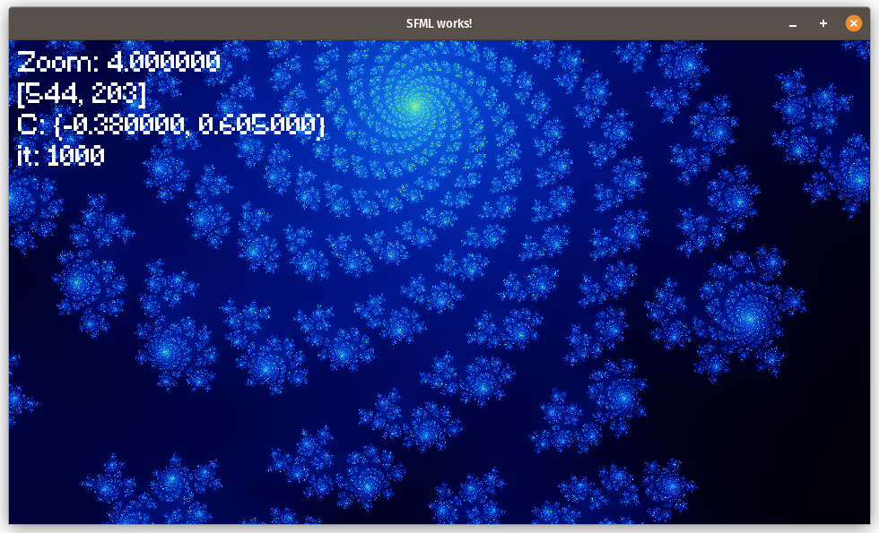

# Fractal Viewer

Fractal Viewer is a C++ application using SFML to render and explore the Julia set fractals. It features smooth zooming, customizable constants, and real-time updates for exploring fractal geometry.

## Features

- *Real-Time Fractal Rendering*: Smooth exploration of the Julia set with dynamic adjustments.
- *Customizable Parameters*:
  - Adjust zoom levels.
  - Modify the Julia set constant (C).
  - Change the maximum number of iterations for higher detail.
- *Interactive Interface*: Mouse and keyboard controls for seamless navigation.

## Controls

### Mouse
- *Left Click*: Re-center the fractal on the clicked location.

### Keyboard
- *Zoom*:
  - Up Arrow: Zoom in.
  - Down Arrow: Zoom out.
- *Adjust Real Part of Constant (C)*:
  - Q: Increase the real part.
  - A: Decrease the real part.
- *Adjust Imaginary Part of Constant (C)*:
  - W: Increase the imaginary part.
  - S: Decrease the imaginary part.
- *Adjust Maximum Iterations*:
  - E: Increase the maximum iterations by 100.
  - D: Decrease the maximum iterations by 100.

## Prerequisites

- [SFML Library](https://www.sfml-dev.org/): Ensure SFML is installed and properly linked to your project.
- A compatible C++ compiler (e.g., GCC, Clang, or MSVC).

## Building and Running

1. *Clone the Repository*:
   
   git clone https://github.com/Ward42Git/FractalViewer.git
   cd FractalViewer
   

2. *Build the Application*:
   - Use the provided Makefile or compile manually:
     
     g++ -o FractalViewer main.cpp helper.cpp -lsfml-graphics -lsfml-window -lsfml-system
     

3. *Run the Application*:
   
   ./FractalViewer
   

## Dependencies

- SFML (Simple and Fast Multimedia Library): For graphics and window management.

## How It Works

- *Fractal Generation*: The program uses the Julia set formula \( Z_{n+1} = Z_n^2 + C \) to compute the fractal, where \( C \) is a user-defined complex constant.
- *Color Mapping*: The number of iterations required for the value to "escape" (modulus > 2) determines the pixel color, creating the fractal's detailed visuals.
- *Smooth Color Transitions*: The color is interpolated for smoother gradients, enhancing visual appeal.

## Example Screenshots

## License

This project is open source and available under the MIT License.

## Acknowledgments

- Inspired by the beauty of fractal geometry.
- Built with the SFML library for graphics and input handling.
